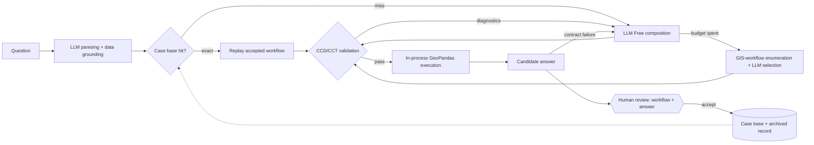

# GeoQA Agent

A live demo is currently available at **https://geoqa4amsterdam.s.gy/**

> **Note:** This repository is a snapshot of a local development repo, published
> for showcase purposes. Development continues locally, so the code here may
> not exactly match what the live demo currently shows.

Geo-analytical question answering for Amsterdam open data: ask a question in
natural language — *e.g. "Which Amsterdam neighborhoods have no registered
public sports locations?"* — and get back a verified, interactive answer map.
An LLM interprets the question and **freely composes** a typed GIS workflow
from a vocabulary of abstract operations; deterministic CCD/CCT type
validation judges the composition; the plan executes in process on GeoPandas
within the same request; and a human reviews the workflow together with its
answer. Accepted workflows are retained in a case base and replayed for
structurally equivalent questions without any planning calls. Every artifact
is stored content-addressed, so each answer carries a full provenance trail.

Inspired by the [QuAnGIS](https://github.com/quangis) project, whose CCD/CCT
semantics and abstraction vocabulary this system builds on.

## Workflow



## Design

The planning stage is a cost ladder — each tier is only entered when the
cheaper one fails, and every tier's output passes the same deterministic
validator:

1. **Retrieval** — accepted workflows are indexed by a structural task
   signature (family + per-role CCD types + constraint shape). An exact hit
   replays with zero planning calls; a near hit becomes a worked example.
2. **Free composition** — the LLM composes an abstract workflow from 55
   CCD/CCT-typed abstraction signatures and maps it onto 18 GeoPandas
   operation contracts, with a bounded diagnostic-driven repair loop.
3. **Type-directed enumeration** — when composition keeps failing, a bounded
   forward-chaining search (the validator's type judgement run as a
   generator) enumerates every well-typed GIS-workflow and the LLM selects by
   intent.

Runtime and answer-contract failures are part of the repair surface too: a
plan that validates but dies at execution or produces a result table outside
the family's output contract is replanned automatically with the failure as
context. What no machine can check — a well-typed workflow that answers the
wrong question — is exactly what the human accept/reject decision is for,
and that decision doubles as the case-base retention gate.

## Limitations

- **Two task families** are supported end to end:
  1. *Distinct point count by polygon support* — e.g. sports locations per
     neighborhood, preserving zero-count neighborhoods;
  2. *Point-to-point Euclidean nearest* — with optional maximum-distance
     cutoffs and all equidistant ties retained.
- **Only five layers**, all sports-themed: neighborhoods (`gebieden/buurten`),
  public sports locations, sports providers, gymnasiums, and swimming pools —
  ingested from official Amsterdam WFS services as immutable catalog
  snapshots.
- **GIS workflow enumeration is explicit BFS, not SAT-based synthesis.** The
  type-directed fallback enumerates well-typed candidate GIS workflows by
  bounded breadth-first forward chaining (depth ≤ 4 over 55 abstraction
  signatures), which is sub-second at the current scale but grows
  combinatorially. Scaling to a larger tool vocabulary or deeper chains would
  mean replacing it with a SAT-based bounded synthesizer in the style of
  [APE](https://github.com/sanctuuary/APE), as used by the original [QuAnGIS](https://github.com/quangis)
  pipeline.
- - **Vector only.** All registered operations are GeoPandas vector
  computations.To do: raster tooling (rasterio-backed operations and raster layer
  ingestion).
- Questions outside this scope are rejected with diagnostics rather than
  answered.

## Repository map

| Path | Contents |
|---|---|
| `src/geoqa_agent/` | Core: interpretation, planning, enumeration, case base, validation, execution |
| `src/data_pipeline/` | WFS → immutable GeoParquet snapshots → versioned catalog |
| `src/metadata_annotation/` | LLM semantic enrichment of catalog metadata |
| `app/api/`, `app/web/` | FastAPI backend and React + MapLibre frontend |
| `ontology/` | CCD ontology and semantic tool ontologies |
| `test/` | pytest suites, including in-process end-to-end tests |
| `infra/terraform/`, `docker/` | Azure deployment and the container image |

## Running it

Requires [pixi](https://pixi.sh) and an OpenAI API key (interpretation and
planning are real model calls; execution is local).

```bash
pixi install
pixi run test            # full suite, no cloud or API keys needed
OPENAI_API_KEY=... pixi run local-sandbox   # in-memory catalog, live WFS ingest on first run
npm --prefix app/web install && npm --prefix app/web run dev
```

The local sandbox serves the production application against an in-memory
copy of the catalog; the Vite dev server proxies the API and supplies a
signed-in identity.

## License

GPL-3.0-only (see [LICENSE](LICENSE)). Third-party components and data sources
are listed in [NOTICES.md](NOTICES.md).
