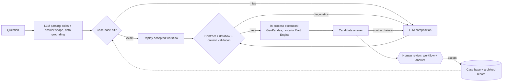

# GeoQA Agent

A live demo is available at **https://geoqa4amsterdam.s.gy/**. The published
worked examples — question, plan, answer map and result table — can be read
without an account; asking your own question requires a GitHub sign-in.

> **Note:** This repository is a snapshot of a local development repo, published
> for showcase purposes. Development continues locally, so the code here may
> not exactly match what the live demo currently shows.

Geo-analytical question answering for Amsterdam open data: ask a question in
natural language — *"Which Amsterdam neighborhoods have no registered public
sports locations?"*, *"What fraction of each borough is tree cover?"* — and
get back a verified, interactive answer map. An LLM interprets the question
as semantic roles to ground in catalog layers plus the **shape of the
answer** (which roles key it, one value column, its measurement scale and how
the value arises), then **composes** a GIS workflow from 27 allow-listed
operation contracts: 18 GeoPandas vector, 4 rasterio raster and 5 Earth
Engine cloud operations. Deterministic validation of contracts, dataflow,
columns and data kinds judges the plan; a passing plan executes within the
same request; and a human reviews the workflow together with its answer.
Accepted workflows are retained in a case base and replayed for structurally
equivalent questions without any planning call. Every artifact is stored
content-addressed, so each answer carries a full provenance trail.

There are no predefined task families and no ontology: the operation
contracts and the answer's declared shape are the whole type system. Any
question whose answer is a keyed table over the catalog — a value per unit
(counts, sums, densities and zonal statistics per neighbourhood, a nearest
distance per object) or a pair table — is in scope, and the validator decides
whether a workflow realises it.

## Workflow



## Design

The planning stage has two tiers; both outputs pass the same deterministic
validator:

1. **Retrieval** — accepted workflows are indexed by a structural task
   signature (answer shape, the geometry or data kind bound to each role,
   and the quantities and periods the question states). An exact hit
   replays with zero planning calls; a near hit becomes a worked example
   in the composition prompt.
2. **Composition** — the LLM composes the workflow from the 27 allow-listed
   operation contracts, each with a description, typed parameters, allowed
   values and outputs, inside a bounded diagnostic-driven repair loop.

What the validator checks, all blocking: operation parameter contracts and
allowed values; the data kind (vector, raster, image, image collection) and
geometry kind each data-binding parameter accepts, tracked through the plan
(centroids yield points, buffers and overlays polygons; a raster chain must
end by summarising onto vector zones or sampling at vector points; an image
collection must be composited before it is reduced); dataflow connectivity
(every ref produced before it is consumed, every retained ref a sink
output); a column-level data-flow analysis that mirrors the runners, so
field parameters, expressions and the answer's key and value columns are
checked before anything runs; measurement scales (a sum or mean needs a
numeric column, a nominal raster band must be reclassified before a
statistic); that the goal's aggregation is realised literally (a sum over an
attribute, never a count of records); the quantities and periods the
question states (a cutoff must reach a parameter literal, a date range the
Earth Engine filter); and the CRS and coverage of the bound layers.

Runtime and answer-contract failures are part of the repair surface too: a
plan that validates but dies at execution or produces a result table outside
the goal's contract is replanned automatically with the failure as context.
What no machine can check — a well-typed workflow that answers the wrong
question — is exactly what the human accept/reject decision is for, and that
decision doubles as the case-base retention gate.

## Models

The planning model is chosen per question in the UI. Registered models:
**Gemini 3.8 Flash** (default; it also annotates the catalog metadata),
**GPT-5.6 Luna** and **DeepSeek V4.1 Flash**. Gemini and OpenAI enforce the
artifact schema server-side; DeepSeek's JSON mode does not, so its adapter
carries the schema in the prompt, validates locally and allows one
corrective turn. Every artifact records the exact model, prompt and schema
versions that produced it.

## Worked examples

An accepted session can be frozen into a worked example: the documents the
browser needs (the session, its answer map, the observation listing and the
rendered raster and satellite views) are produced once and served to
visitors as they are. Examples never expire and cost nothing per view, and
each one deep-links as `/?showcase=<session_id>`.

## Limitations

- **Answers are keyed tables.** A question must resolve to a value per unit
  or a pair table over catalog layers (counts, sums, densities and zonal
  statistics per unit, nearest-neighbour distance with optional cutoffs and
  ties retained, attribute thresholds on either side). Scalar answers and
  rankings are not yet answer shapes.
- **26 catalog layers.** Twenty-one vector layers from official Amsterdam WFS
  services — the three `gebieden` tessellations (neighborhoods, districts,
  boroughs) and eighteen object layers: sports locations, providers,
  gymnasiums, swimming pools, sports halls, sports parks and fields
  (polygons), running routes (lines), waste containers and clusters,
  construction power points, fauna facilities, bicycle bollards, coach
  stops, moorings and boat boarding points, traffic information systems,
  shopping areas — three local rasters (AHN surface and terrain elevation,
  ESA WorldCover land cover) and two Earth Engine collections (Sentinel-2
  surface reflectance, Dynamic World), all ingested as immutable, versioned
  catalog snapshots. Adding a public vector layer is a pinned
  `LayerDefinition` entry, not new pipeline code.
- **Attribute typing follows the annotation, not the storage.** A numeric
  attribute stored as text (a capacity given as `25-27`) is typed by its
  annotated measurement scale; a plan that compares it numerically fails at
  execution and is replanned.
- **Rasters end in vector tables.** Local rasters share one 10 m grid and
  enter a workflow through four rasterio operations; Earth Engine
  collections enter through five `gee:*` operations that build a remote
  recipe and compute only when reduced onto zones or exported. Either chain
  must end by summarising onto vector zones or sampling at vector points;
  rasters are never an answer by themselves. Earth Engine needs a
  service-account key in the container.
- Questions outside this scope are rejected with diagnostics rather than
  answered.

## Repository map

| Path | Contents |
|---|---|
| `src/geoqa_agent/` | Core: interpretation, planning, case base, validation, column flow, execution and runners, model clients |
| `src/data_pipeline/` | WFS, raster and Earth Engine ingestion → immutable snapshots → versioned catalog |
| `src/metadata_annotation/` | LLM semantic enrichment of catalog metadata |
| `app/api/`, `app/web/` | FastAPI backend and React + MapLibre frontend |
| `scripts/` | Operator entry points: ingestion, annotation, sandboxes, worked-example publishing, redeploy |
| `test/` | pytest suites, including in-process end-to-end tests |
| `infra/terraform/`, `docker/` | Azure deployment and the container image |

## Running it

Requires [pixi](https://pixi.sh) and a Google API key for Gemini
(interpretation, planning and annotation are real model calls; execution is
local). An OpenAI or DeepSeek key adds the other planning models; an Earth
Engine service-account key enables the `gee:*` operations.

```bash
pixi install
pixi run test            # full suite, no cloud or API keys needed
GOOGLE_API_KEY=... pixi run local-sandbox   # in-memory catalog, live WFS ingest on first run
npm --prefix app/web install && npm --prefix app/web run dev
```

The local sandbox serves the production application against an in-memory
copy of the catalog; the Vite dev server proxies the API and supplies a
signed-in identity.

## License

GPL-3.0-only (see [LICENSE](LICENSE)). Third-party components and data sources
are listed in [NOTICES.md](NOTICES.md).
